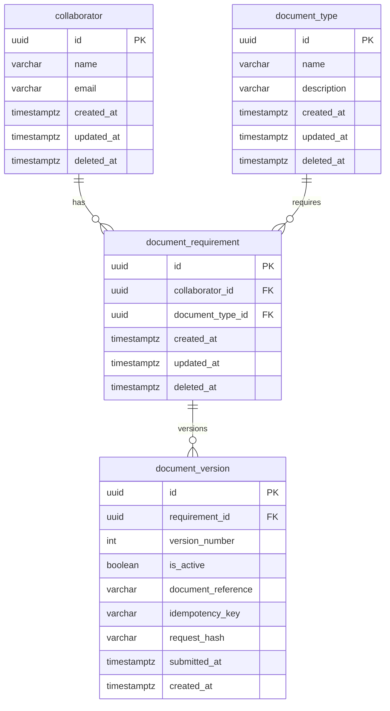

# API de Documentação de Colaboradores

API REST para gerenciamento da documentação obrigatória de colaboradores — teste técnico Inmeta.

O sistema controla o cadastro de colaboradores, o catálogo de tipos de documento, os vínculos obrigatórios (requirements), o envio lógico com histórico de versões, a consulta de pendências, o dashboard de estatísticas e soft delete. Upload físico de arquivos (S3/storage) e **autenticação/autorização estão fora do escopo**.

## Objetivos arquiteturais

Durante o desenvolvimento foram priorizados:

- consistência transacional;
- modelagem relacional;
- separação de responsabilidades;
- histórico de versões;
- tratamento de concorrência;
- idempotência;
- testes automatizados;
- evolução do schema por migrations;
- documentação das decisões e trade-offs.

## Stack

| Camada | Tecnologia |
|---|---|
| Runtime | Node.js 22+ · NestJS 11 |
| Banco | PostgreSQL 16 (Docker Compose) |
| ORM | TypeORM 0.3.31 (`synchronize: false`) |
| Validação | class-validator + Joi (env) |
| Docs | Swagger (`/docs`) |
| Health | @nestjs/terminus (`/health`) |
| Testes | Jest (unitário + E2E com Postgres real) |
| CI | GitHub Actions |

## Como executar

```bash
npm ci
cp .env.example .env
docker compose up -d
npm run migration:run
npm run start:dev
```

A API sobe em `http://localhost:3000`. Contratos detalhados, schemas e respostas de erro estão em `http://localhost:3000/docs`.

### Porta do PostgreSQL

O `.env.example` usa `DB_PORT=5434` para evitar conflito com outras instâncias locais (5432/5433). Ajuste conforme sua máquina. O container escuta `5432` internamente; o host mapeia `${DB_PORT}`.

### Qualidade local

```bash
npm run lint          # ESLint (não altera arquivos)
npm run lint:fix     # ESLint com correção automática
npm run build
npm test
npm run test:e2e      # aplica migrations (pretest) + suite E2E
npm run test:cov
npm run migration:run
npm run migration:revert
```

## Endpoints

Contratos completos (DTOs, exemplos, códigos de erro) em `/docs`.

### Infrastructure

| Método | Rota | Descrição |
|---|---|---|
| GET | `/health` | Health check (inclui ping ao PostgreSQL) |
| GET | `/docs` | Swagger UI |

### Collaborators

| Método | Rota | Descrição |
|---|---|---|
| POST | `/collaborators` | Cadastro |
| GET | `/collaborators` | Listagem paginada (`page`, `limit`, `name`, `email`, `status`) |
| GET | `/collaborators/:id` | Busca por ID |
| DELETE | `/collaborators/:id` | Soft delete (`204`) |

`status`: `active` (padrão), `deleted`, `all`.

### Document Types

| Método | Rota | Descrição |
|---|---|---|
| POST | `/document-types` | Cadastro |
| GET | `/document-types` | Listagem paginada (`page`, `limit`, `name`, `status`) |
| GET | `/document-types/:id` | Busca por ID |
| DELETE | `/document-types/:id` | Soft delete (`204`) |

### Document Requirements

| Método | Rota | Descrição |
|---|---|---|
| POST | `/document-requirements` | Vincula colaborador ↔ tipo |
| GET | `/document-requirements` | Listagem paginada |
| GET | `/document-requirements/:id` | Busca por ID |
| DELETE | `/document-requirements/:id` | Soft delete / desvínculo (`204`) |

### Pending Documents

| Método | Rota | Descrição |
|---|---|---|
| GET | `/document-requirements/pending` | Requisitos ativos sem versão ativa (paginado + filtros) |

### Document Versions

| Método | Rota | Descrição |
|---|---|---|
| POST | `/document-requirements/:requirementId/versions` | Envio lógico (cria versão; header `Idempotency-Key` obrigatório) |
| GET | `/document-requirements/:requirementId/versions` | Histórico de versões |
| GET | `/document-versions/:id` | Busca versão por ID |

### Statistics

| Método | Rota | Descrição |
|---|---|---|
| GET | `/statistics` | Dashboard consolidado (percentual, totais, tipos pendentes, últimos envios) |

## Modelagem

Todas as entidades abaixo estão **implementadas**. Tabelas no singular.

| Entidade | Tabela | Soft delete | Observação |
|---|---|---|---|
| Collaborator | `collaborator` | Sim | E-mail único entre ativos |
| DocumentType | `document_type` | Sim | Nome único entre ativos |
| DocumentRequirement | `document_requirement` | Sim (desvínculo) | Único par colaborador+tipo ativo |
| DocumentVersion | `document_version` | Não (append-only) | Uma ativa por requisito; idempotência |



## Arquitetura

```text
HTTP Request
    ↓
Controller      → contrato HTTP, status codes, DTOs
    ↓
Service         → regras de domínio, orquestração, exceções
    ↓
Repository      → QueryBuilder, agregações, soft delete explícito
    ↓
TypeORM
    ↓
PostgreSQL
```

Mapper converte Entity → DTO de resposta. Filter global padroniza erros (`statusCode`, `error`, `message`, `timestamp`, `path`).

Estrutura:

```text
src/
├── collaborators/
├── document-types/
├── document-requirements/
├── document-versions/
├── statistics/
├── common/
├── config/
├── database/          # data-source CLI + migrations
├── health/
├── app.module.ts
└── main.ts
```

## Regras centrais

| Tema | Regra |
|---|---|
| Soft delete | Removidos retornam `404` em mutações/busca operacional; listagens usam `status` |
| Vínculo | Um par ativo colaborador ↔ tipo por vez (unique parcial) |
| Pendência | Derivada: requisito ativo **sem** versão ativa |
| Histórico | Versões append-only; reenvio desativa a ativa e cria a próxima |
| Uma ativa | Constraint parcial `UNIQUE (requirement_id) WHERE is_active = true` |
| Concorrência | `SELECT FOR UPDATE` no requisito dentro da transação de envio |
| Idempotência | Header `Idempotency-Key` + `request_hash`; replay `200` / conflito `409` |
| Estatísticas | Agregadas em leitura via QueryBuilder (`GET /statistics`) |

Status `PENDING` / `COMPLETED` **não** são colunas — sempre derivados na consulta.

## Concorrência e atomicidade

No envio de versão, a API abre uma transação e faz `SELECT ... FOR UPDATE` (`pessimistic_write`) na linha do **DocumentRequirement**. Dentro do mesmo lock:

1. valida requisito / colaborador / tipo ativos;
2. trata idempotência;
3. desativa a versão ativa (se houver);
4. calcula o próximo `versionNumber`;
5. cria a nova versão ativa.

Envios do **mesmo** requisito são serializados. Requisitos **diferentes** seguem em paralelo.

**Limite da estratégia:** o lock está no requisito. Colaborador e tipo **não** são bloqueados durante o envio — a validação de “ativo” ocorre sob o lock do requisito, mas não serializa mutações nesses agregados. Soft delete concorrente do requisito com o envio é serializado pela mesma linha.

Constraints permanecem como última camada:

| Constraint | Proteção |
|---|---|
| `UNIQUE (requirement_id, version_number)` | impede número duplicado |
| `UNIQUE (requirement_id) WHERE is_active = true` | no máximo uma ativa |

O lock é no PostgreSQL: funciona entre múltiplas instâncias da API. Mutex em memória não seria suficiente.

**Concorrência ≠ idempotência:** operações distintas simultâneas geram versões distintas; retries da mesma operação reutilizam a chave.

## Idempotência

| Aspecto | Comportamento |
|---|---|
| Escopo | Por `(requirementId, Idempotency-Key)` |
| Armazenamento | Colunas em `document_version` + unique |
| Hash | SHA-256 do payload (`documentReference`) |
| Replay | Mesma chave + mesmo hash → `200` (versão existente) |
| Conflito | Mesma chave + hash diferente → `409` |
| Retry vs nova operação | Mesma chave = retry; chave nova = nova versão |

O header é obrigatório no `POST .../versions`. Ausente ou inválido → `400`.

## Pendências

```text
DocumentRequirement ativo
        │
        ▼
 Existe versão ativa?
   ├─ SIM → não é pendente
   └─ NÃO → pendente
```

Consulta: `LEFT JOIN` na versão ativa + `WHERE activeVersion.id IS NULL` (sem N+1). Endpoint: `GET /document-requirements/pending`.

## Estatísticas

Endpoint único `GET /statistics`:

| Campo | Conteúdo |
|---|---|
| `completionPercentage` | `(completed / requirements) * 100`, 2 casas; `0` se vazio |
| `totals` | `requirements`, `completed`, `pending` |
| `mostPendingDocumentTypes` | agrupado por tipo; `pendingCount DESC`, `name ASC` |
| `latestSubmissions` | até 10 envios; `submittedAt DESC` |

```text
Requirements ativos (colaborador/tipo ativos)
        │
        ▼
 Existe versão ativa?
   ├─ SIM → completed
   └─ NÃO → pending
```

Três agregações independentes rodam em paralelo (`Promise.all`). **Sob escritas concorrentes, pode existir pequena diferença temporal entre os blocos da resposta.** Um snapshot transacional com isolamento apropriado seria evolução se consistência temporal estrita fosse necessária.

Sistema sem dados → `200` com zeros e listas vazias (nunca `404`).

## Testes

| Tipo | Escopo |
|---|---|
| Unitários | Services/controllers com repository mockado (`80` testes) |
| E2E | PostgreSQL real via Docker / CI service (`104` testes) |
| Cobertura unitária | Statements **67.86%** · Branches **58.10%** · Functions **50.42%** · Lines **67.86%** (`npm run test:cov`) |

E2E cobre soft delete, concorrência, rollback forçado, idempotência, pendências e estatísticas. Usa o banco configurado por env, aplica migrations (`pretest:e2e`), faz `TRUNCATE ... CASCADE` entre suites e **não** depende de dados manuais nem de sleeps.

`test/jest-e2e.json` define `maxWorkers: 1`: a suíte é **serial** porque compartilha um único Postgres. Workers paralelos geram deadlock em `TRUNCATE` e contaminação entre suites.

A cobertura unitária usa `coverageProvider: "v8"` (compatível com Node 22+; a instrumentação babel padrão falhava no Node 25). Repositórios, modules e health ficam parcialmente descobertos nos unitários — o comportamento de persistência é coberto pelos E2E.

## CI

Workflow [`.github/workflows/ci.yml`](.github/workflows/ci.yml) em `push`/`pull_request` para `main`:

```text
checkout → setup Node 22 (cache npm) → npm ci
  → migrations → lint → build → unit tests → E2E
```

PostgreSQL 16 sobe como service container com credenciais descartáveis de CI (`api_documentos_ci`). Variáveis alinhadas à validação Joi e ao `data-source.ts`.

## Decisões e trade-offs

### Migrations only (`synchronize: false`)

Schema evolui só por migrations versionadas (`up`/`down`). Evita alteração acidental em runtime.

### TypeORM 0.3.31

Linha estável com CLI funcional. `typeorm@1.x` (“latest”) quebrava o CLI (`ERR_REQUIRE_ESM`).

### UUID via `pgcrypto` (`gen_random_uuid()`)

Nativo no PostgreSQL 13+; dispensa `uuid-ossp`.

### Soft delete + unique parcial

Permite reutilizar e-mail/nome após remoção sem perder histórico. Repositories filtram `deleted_at IS NULL` explicitamente.

### Repository concreto (sem ports)

Controller → Service → Repository concreto. Enquanto entities/migrations forem TypeORM, uma interface não elimina o acoplamento real — apenas adiciona boilerplate. Persistência fica contida em Entity + Repository + migrations.

### Paginação offset/limit

`page` + `limit` (máx. 100), ordenação estável. Suficiente para o volume do desafio.

### Envio lógico (sem storage)

`documentReference` é referência textual — não há upload/S3. Escopo do teste é versionamento e regras.

### Sem autenticação

Restrição explícita do enunciado.

### Pool e overrides npm

Pool configurável via env. Overrides pontuais (`js-yaml`, `glob`) mitigam advisories sem `npm audit fix --force` (que sugeria TypeORM/CLI incompatíveis).

### E2E serial no mesmo banco

Estabilidade > paralelismo neste escopo. Evolução: banco de teste dedicado ou Testcontainers.

### Cobertura com provider V8

`coverageProvider: "v8"` no Jest: a instrumentação babel padrão falhava ao coletar cobertura no Node 25 (`ERR_INVALID_ARG_TYPE` em `util`). V8 funciona em Node 22 (CI) e 25 (dev local).

---

## Licença

UNLICENSED — uso privado (teste técnico).
